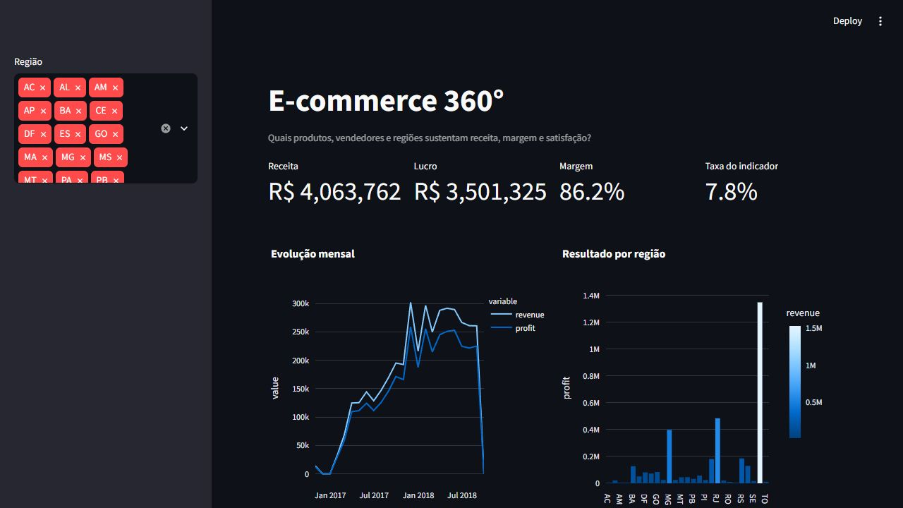

# Cinco projetos para apresentar em processos seletivos

## 1. E-commerce 360°

- Base: 25.000 pedidos reais anonimizados da Olist.
- Receita analisada: **R$ 4.063.762,47**.
- Resultado após frete: **R$ 3.501.324,65**.
- **7,85%** dos pedidos da amostra chegaram após a data estimada.
- São Paulo concentrou o maior resultado absoluto; `relogios_presentes` liderou a receita por categoria na amostra.
- Decisão sugerida: investigar margem por categoria e estado junto do SLA logístico, evitando priorização baseada apenas em faturamento.

## 2. Churn de clientes

- Base: 3.150 clientes reais de uma operadora iraniana, disponibilizados pela UCI.
- Churn observado: **15,71%**.
- Modelo: Random Forest com pré-processamento categórico e numérico.
- Resultado de teste: **ROC AUC 0,9555** e acurácia **91,62%**.
- Decisão sugerida: ordenar ações de retenção pela combinação entre risco, valor do cliente e custo do incentivo.

## 3. Funil de marketing

- Base: 8.000 leads reais anonimizados do funil comercial da Olist.
- Conversão observada em negócio fechado: **10,52%**.
- Receita mensal declarada pelos leads convertidos: **R$ 61.784.006**.
- Modelo sem atributos pós-conversão: ROC AUC **0,6743**, resultado mais realista que uma pontuação artificialmente perfeita.
- Decisão sugerida: avaliar origem e landing page por conversão incremental, não apenas por volume de leads.

## 4. Demanda e estoque

- Base: amostra determinística de 25.000 transações reais do UCI Online Retail.
- Receita analisada: **£ 477.432,20**; margem estimada sob hipótese explícita de custo: **£ 167.101,27**.
- `REGENCY CAKESTAND 3 TIER` liderou a receita por descrição na amostra.
- Erro absoluto médio do modelo: **0,27 unidade** na divisão de teste.
- Decisão sugerida: combinar previsão com tempo de reposição e variabilidade para definir estoque de segurança.

## 5. Pipeline empresarial

- Base: 25.000 pedidos reais anonimizados da Olist.
- O pipeline valida duplicidade, valores ausentes, volume, receita, resultado, origem e modo de aquisição.
- Pedidos não entregues representaram **2,92%** da amostra.
- Modelo de classificação: ROC AUC **0,8944**.
- Decisão sugerida: impedir a publicação do dashboard quando testes de qualidade ou atualização falharem.

## Como apresentar

Use a sequência: problema → dados → tratamento → análise → resultado → recomendação → limitação. Não diga apenas que “criou um dashboard”; explique qual decisão ele permite tomar e qual risco permanece.

