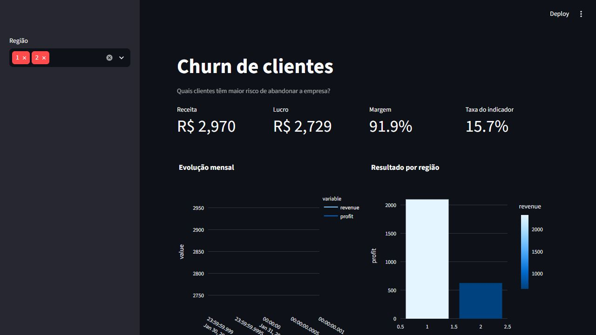

# Churn de clientes



## Problema de negócio

Quais clientes têm maior risco de abandonar a empresa?

## Base real utilizada

**UCI Iranian Churn Dataset, dados reais de uma operadora**

- Modo: `real`
- Registros processados: 3,150
- Valores ausentes após tratamento: 0
- IDs duplicados identificados: 0

Os arquivos brutos não são versionados. Consulte `../../FONTES.md` e execute o script de aquisição antes do pipeline.

## Implementação individual

- `pipeline.py`: converte o esquema original para a camada analítica deste caso.
- `analysis.sql`: calcula tendências, ranking, crescimento e margem sobre a fonte processada.
- `model.py`: treina o modelo `classification` definido para a decisão.
- `dashboard.py`: apresenta indicadores, evolução temporal e recortes executivos.

## Métricas da última execução

```json
{
  "accuracy": 0.9162,
  "roc_auc": 0.9555
}
```

## Recomendação executiva

Acionar retenção apenas quando valor esperado superar o custo do incentivo.

## Execução

```powershell
python pipeline.py
python model.py
streamlit run dashboard.py
```

## Limitações

Os resultados são analíticos e não devem ser convertidos automaticamente em decisões sobre pessoas. Valide estabilidade temporal, representatividade, viés e custo de erro antes de qualquer uso operacional.
